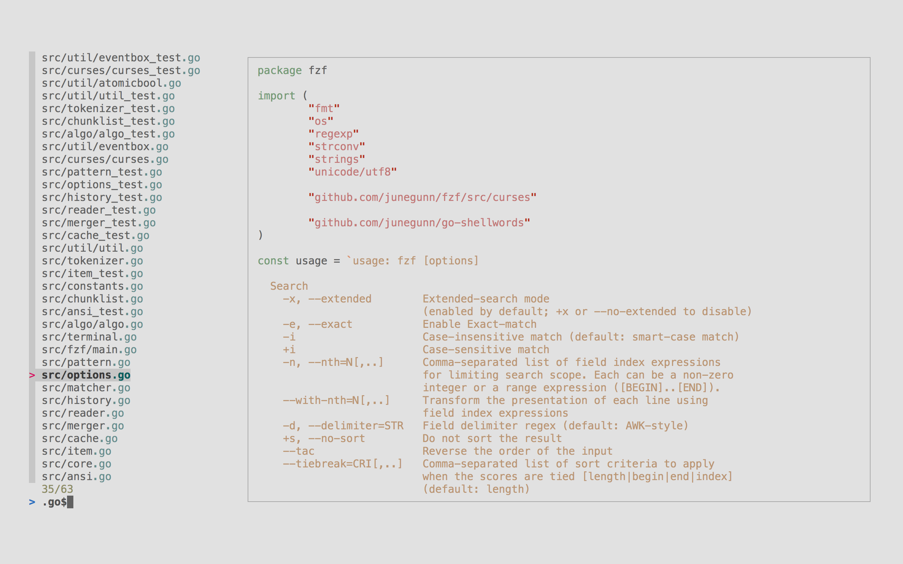

# fzf

Interactive Unix filter for command-line that can be used with **any list**; files, command history, processes, hostnames, bookmarks, git commits, etc.

| Resource | Link |
| :--- | :--- |
| Repository | [https://github.com/junegunn/fzf/](https://github.com/junegunn/fzf/) |
| Documentation | [https://github.com/junegunn/fzf/\#usage](https://github.com/junegunn/fzf/#usage) |
| Related projects | [https://github.com/junegunn/fzf/wiki/Related-projects](https://github.com/junegunn/fzf/wiki/Related-projects) |

### Integrations

| Tool | Link | Description | Status |
| :--- | :--- | :--- | :--- |
| `vim` | [https://github.com/junegunn/fzf.vim](https://github.com/junegunn/fzf.vim) | Fuzzy finder for files within vim. | Packaged. |
| `zsh` | [https://github.com/urbainvaes/fzf-marks](https://github.com/urbainvaes/fzf-marks) | Bookmark directories and access them with fzf. | &lt;Pending&gt; |

### Configuration Files

| Location | Description |
| :--- | :--- |
| &lt;Pending&gt; | &lt;Pending&gt; |

## Why is this tool installed?

It's a general-purpose tool for traversing files, directories and any kind of list with blazing-fast speeds without adding any extra dependencies. It also integrates with third party tools, including popular text-editors, shells and more.

